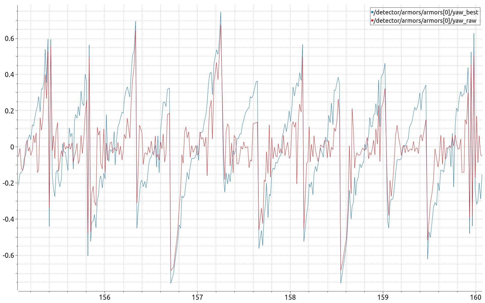
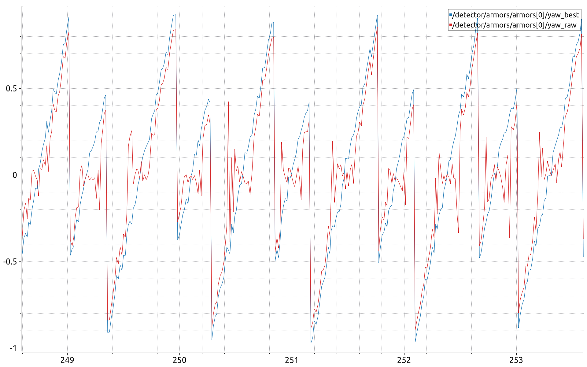

# HBUT2025视觉代码

## TODO:

gimbal_control内的弹道解算需要优化

detector层的性能优化，感觉ros2图像消息接受会排队

将detector和solver的debug消息单独拉出来成一个进程

## 编译

```shell
rosdep install --from-paths src --ignore-src -r -y
sudo apt-get install ros-humble-asio-cmake-module
./build.sh
colcon build --cmake-args -DCMAKE_EXPORT_COMPILE_COMMANDS=ON
ros2 launch bringup armor_launch.py
#或者
bash armor_bringup.sh 
#烧饼多机通讯
ros2 launch rosbridge_server rosbridge_websocket_launch.xml
ros2 param load /armor_detector src/bringup/config/params.yaml
```
### 相机标定
相机节点

```bash
ros2 launch mindvision_camera mv_launch.py
```

相机标定

```bash
ros2 run camera_calibration cameracalibrator --size 7x10 --square 0.02000  image:=/image_raw
```

### 开机自启设置

创建service文件

```bash
sudo vim /etc/systemd/system/rm_vision_launch.service
```

每次修改完service文件后需要执行

```bash
sudo systemctl daemon-reload
```

启动开机自启动

```bash
sudo systemctl enable rm_vision_launch.service
```

关闭开机自启动

```bash
sudo systemctl disable rm_vision_launch.service
```

开启服务

```bash
sudo systemctl start rm_vision_launch.service
```

停止服务

```
sudo systemctl stop rm_vision_launch.service
```

查看日志

```bash
journalctl -u rm_vision_launch.service -f
```

## 针对远距离观测yaw优化

在8mm镜头，目标距离相机4-5m的时候，灯条在图像中所占的像素已经非常小。


PNP在这种尺度下，观测出来的目标tvec和rvec误差和波动非常大。故参考同济大学在2024年的自瞄开源，在当前的自瞄准框架下，采用降维重投影的方法重建yaw。经过测试5m下的观测yaw精度有所提升。



3m目标旋转观测yaw



## 编码规范：

### 头文件
#### #define 保护
```c++
#ifndef FOO_BAR_BAZ_H_
#define FOO_BAR_BAZ_H_
...
#endif // FOO_BAR_BAZ_H_
```
#### #include 的路径及顺序
使用标准的头文件包含顺序可增强可读性, 避免隐藏依赖: 相关头文件, C 库, C++ 库, 其他库的 .h, 本项目内的 .h.

又如, dir/foo.cc 或 dir/foo_test.cc 的主要作用是实现或测试 dir2/foo2.h 的功能, foo.cc 中包含头文件的次序如下:
   1. dir2/foo2.h (优先位置, 详情如下)
   2. C 系统文件
   3. C++ 系统文件
   4. 其他库的 .h 文件
   5. 本项目内 .h 文件

### 命名
#### 文件名
文件名要全部小写, 可以包含下划线 (\_) 或连字符 (-), 依照项目的约定. 如果没有约定, 那么 “_” 更好.
```txt
my_useful_class.cc
my-useful-class.cc
myusefulclass.cc
```
C++ 文件要以 .cc 结尾, 头文件以 .h 结尾. 专门插入文本的文件则以 .inc 结尾

#### 类型命名
类型名称的每个单词首字母均大写, 不包含下划线: `MyExcitingClass`, `MyExcitingEnum`  


所有类型命名 —— 类, 结构体, 类型定义 (typedef), 枚举, 类型模板参数 —— 均使用相同约定, 即以大写字母开始, 每个单词首字母均大写, 不包含下划线. 例如:
```c++
// 类和结构体
class UrlTable { ...
class UrlTableTester { ...
struct UrlTableProperties { ...

// 类型定义
typedef hash_map<UrlTableProperties *, string> PropertiesMap;

// using 别名
using PropertiesMap = hash_map<UrlTableProperties *, string>;

// 枚举
enum UrlTableErrors { ...
```

#### 变量命名
变量 (包括函数参数) 和数据成员名一律小写, 单词之间用下划线连接. 类的成员变量以下划线结尾, 但结构体的就不用, 如: `a_local_variable`, `a_struct_data_member`, `a_class_data_member_`.

##### 普通变量命名
```c++
string table_name;  // 好 - 用下划线.
string tablename;   // 好 - 全小写.

string tableName;  // 差 - 混合大小写
```

##### 类数据成员
不管是静态的还是非静态的, 类数据成员都可以和普通变量一样, 但要接下划线.

```c++
class TableInfo {
  ...
 private:
  string table_name_;  // 好 - 后加下划线.
  string tablename_;   // 好.
  static Pool<TableInfo>* pool_;  // 好.
};
```

##### 结构体变量
不管是静态的还是非静态的, 结构体数据成员都可以和普通变量一样, 不用像类那样接下划线:

```c++
struct UrlTableProperties {
  string name;
  int num_entries;
  static Pool<UrlTableProperties>* pool;
};
```

##### 函数命名

常规函数使用大小写混合, 取值和设值函数则要求与变量名匹配: `MyExcitingFunction()`, `MyExcitingMethod()`, `my_exciting_member_variable()`, `set_my_exciting_member_variable()`

##### 枚举命名
枚举的命名应当和 常量 或 宏 一致: kEnumName 或是 ENUM_NAME.

##### 宏命名
像这样命名: MY_MACRO_THAT_SCARES_SMALL_CHILDREN.

## 实车部署

### 硬件连接

- 相机：USB 直连电脑（mindvision 驱动），DJI 相机走网口
- 云台：电控 MCU 通过串口（USB 转串口）连电脑，电脑跑 lc_serial 节点；
  电控程序负责收 yaw/pitch/is_fire 指令、驱动云台电机、回传 IMU 实际角度（/gimbal_feed）

### 相机内参（不是相机自动发的）

内参是标定出来的，写进 `src/bringup/config/camera_info.yaml`，
相机节点启动时读取并通过 /camera_info 话题发布，检测节点订阅它做 PnP。

标定方法：

```bash
ros2 run camera_calibration cameracalibrator --size 7x10 --square 0.02000 image:=/image_raw
```

上实车第一步：确认 camera_info.yaml 是当前相机+镜头的标定结果（焦距、分辨率、畸变）。

### 上实车步骤

```bash
# 1. 硬件就绪
ls /dev/ttyACM0                     # 串口设备名
sudo usermod -aG dialout $USER      # 串口权限（首次）

# 2. 改 params.yaml
#    /mv_camera.camera_info_url  → 当前相机标定文件
#    /lc_serial_driver.device_name → 实际串口
#    /gimbal_controller.shoot_speed → 实车弹道标定值

# 3. 按当天任务启动
ros2 launch bringup armor_launch.py          # 打装甲板
ros2 launch bringup energy_real_launch.py    # 打能量机关（默认大符打红符）
ros2 launch bringup outpost_real_launch.py   # 打前哨站

# 4. 验证
ros2 topic echo /gimbal_feed     # 有数据 = 串口通
ros2 run tf2_tools view_frames   # tf 树完整
# 无弹联调 → 云台收敛 + 开火判定正常 → 再实弹
```

注意：哨兵用二进制协议（lc_rm_serial），其他兵种用 CJSON（lc_serial），
实车按兵种把 launch 里的串口节点换成对应的。
